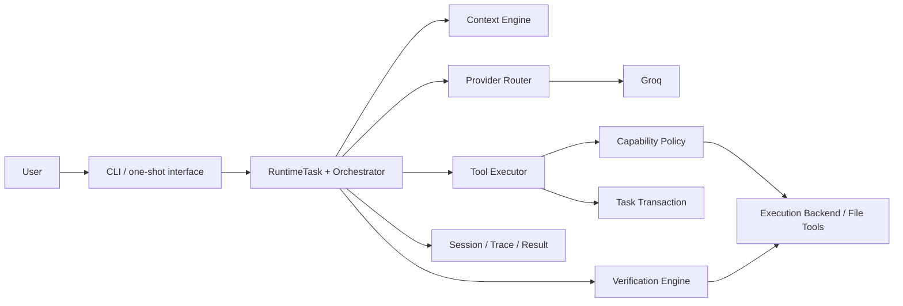

# Sable

[](https://github.com/atrx07/Sable-AI/actions/workflows/ci.yml)
[](https://github.com/atrx07/Sable-AI/actions/workflows/codeql.yml)
[](docs/platforms.md)
[](LICENSE)

Sable is a local-first agentic coding runtime with bounded tools, transactional
editing, capability approvals, deterministic verification, repository-aware context,
structured observability, and adversarial evaluation. Groq supplies inference;
Sable keeps project inspection, mutation, command execution, policy, and evidence on
the host.

It is built for developers who want an inspectable control plane around a coding
model—not just a prompt forwarded to a shell. Sable scopes file tools to one
workspace, records recoverable edits, distinguishes verification failure from
incomplete verification, and makes elevated actions explicit.

> Sable 2.0.0 has not been published to PyPI. Install from this source repository or
> a locally built artifact; do not assume `pip install sable-ai-agent` is available.

## Quick start

Python 3.10–3.13 is the maintained CI range.

```bash
git clone https://github.com/atrx07/Sable-AI.git
cd Sable-AI
python -m venv .venv
```

Activate the environment (`. .venv/bin/activate` on POSIX or
`.venv\Scripts\Activate.ps1` in PowerShell), then install the checkout:

```bash
python -m pip install -e .
sable --version
```

Run Sable against an existing project:

```bash
cd ../my-project
sable .
sable run "Fix the failing tests" .
sable run "Fix the failing tests" . --json
sable doctor .
```

`sable .` is interactive. `sable run` performs exactly one task and exits. `doctor`
is offline and read-only; missing provider configuration correctly makes it report
NOT READY. Configure a Groq key through `GROQ_API_KEY` or the interactive `/keys`
command. Keys entered through `/keys` are explicitly stored as plaintext in the
private local config; environment keys are used without being persisted.

Termux has a dedicated `bash install.sh` path. It is not a generic Linux or Windows
installer. See [platform support](docs/platforms.md) before using it.

## How Sable operates



The runtime—not the model—owns phase transitions, budgets, capability requests,
approvals, transactions, verification outcomes, and optional Git automation. A model
response may request a tool, but only the first real tool call in a turn can execute;
the model must observe that result before another action is considered.

Repository discovery and the context engine select bounded, symbol/import/test-aware
material before reasoning. Main reasoning and optional context compression use a
normalized provider route. Tool requests then pass through capability policy,
workspace/path checks, and an execution backend before results return to the loop.

[Architecture](docs/architecture.md) provides the complete component, lifecycle,
trust-boundary, verification, transaction, and evaluation diagrams.

## Control and safety model

### Enforced by Sable

- file-tool paths, including resolved symlinks, must remain inside the workspace;
- protected credential/config paths are rejected before file access;
- plan mode is a hard read-only ceiling for model-originated actions;
- elevated actions use runtime-created, exact-action allow-once/session approvals;
- normal project processes receive a private HOME and sanitized environment;
- shell execution is disabled by default and only requestable under `yolo` policy;
- independent model-turn, tool-call, verification, output, and time budgets are bounded;
- Sable file-tool mutations are snapshotted before their first change;
- required verification must pass before verified auto-commit;
- remote Git publication is capability-gated and auto-push defaults off.

### Not provided

- kernel, container, or arbitrary child-process filesystem isolation;
- arbitrary process network or process-namespace isolation;
- complete reversal of subprocess side effects;
- perfect prompt-injection resistance;
- semantic proof that code or tests are globally correct.

Repository text, source comments, model output, and tool/test output are untrusted
data. They cannot mint an approval or change its scope. This is prompt-injection
hardening backed by runtime policy, not prompt-injection immunity. Native processes
retain the Sable OS user's permissions; Termux/PRoot provides best-effort filesystem
remapping, not a kernel security boundary. Use a separately configured container,
VM, restricted OS account, or kernel sandbox for genuinely hostile code.

| Mode | Model-originated authority |
|---|---|
| `plan` | Workspace and local-Git reads; mutation cannot be approved |
| `build` | Workspace edits and restricted direct processes; destructive, network, package, raw-shell, and publish actions are denied |
| `yolo` | Elevated actions become requestable through scoped human approval; hard boundaries remain |

Read the [security model](SECURITY.md) and
[execution controls](docs/execution-security.md) before running unfamiliar projects.

## A deterministic example

This is a compact rendering of the real `coding.simple_bug` **deterministic scripted
evaluation**, not a live-model transcript. The fixture, scripted provider responses,
real Sable runtime path, and machine assertions are committed. The latest local
Windows run produced this structured outcome:

```text
Task: fix the calculation bug and verify it
Context: 2 required files selected from a 3-file fixture (recall 2/2)
Tool calls: 1 workspace write across 2 model turns
Changed: calculator.py
Unchanged: notes.txt, tests/test_calculator.py
Verification: PASS
Transaction: COMPLETED; rollback AVAILABLE
Outcome: TASK_PASS / VERIFICATION_PASSED
```

The assertions—not this prose—are authoritative. Reproduce the suite with:

```bash
python -m sable.evals \
  --baseline evals/baselines/m7-deterministic.json \
  --output evals/reports/generated/local
```

The [demo guide](docs/demo.md) provides focused coding, refusal, repair, transaction,
and automation walkthroughs. The [evaluation guide](evals/README.md) explains how
deterministic and live modes differ.

## Transactions and undo

Each natural-language task opens a `TaskTransaction`. Before a Sable file tool first
mutates a path, the runtime stores a bounded baseline snapshot. It records the
post-state fingerprint, verification state, checkpoints, dirty-at-start paths, and
any Sable-created commit.

```text
/txn
/txn show <transaction-id>
/undo --dry-run
/undo
```

Undo restores a path only when its current fingerprint still matches Sable's recorded
post-state. Later user edits are preserved and reported as conflicts. Undo changes
the working tree; it never resets, cleans, checks out, or rewrites Git history.
Subprocesses can change resources outside the file-tool transaction and their side
effects are not fully reversible. See [transactions](docs/transactions.md).

## Verification

Verification is a deterministic, runtime-owned gate:

| Scope | Purpose |
|---|---|
| `QUICK` | Low-cost syntax/configuration checks suitable for rapid feedback |
| `AFFECTED` | Quick checks plus heuristically selected tests related to changed files |
| `FULL` | The broadest discovered/configured project checks within the budget |

Sable discovers project tooling, constructs a typed `VerificationPlan`, runs checks
through the same execution backend, classifies structured results, and may request a
bounded repair only after a genuine failure. Repairs receive redacted diagnostics,
stop on repeated failure signatures, and are checked for likely test weakening.
Unavailable tools, timeouts, and policy blocks remain `INCOMPLETE` or `BLOCKED`; they
are never converted to a verified pass. Manifest and verification-config changes
escalate affected verification to full.

Green verification is evidence from the configured/discovered checks, not proof of
global correctness. Affected selection and integrity checks are conservative
heuristics. See [verification](docs/verification.md).

## Automation

Use `--json` only with `sable run`:

```bash
sable run "Fix the parser regression and add coverage" . --json
```

Stdout is one schema-versioned final JSON document; progress and approval prompts go
to stderr. A bounded shape is:

```json
{
  "schema_version": 1,
  "status": "completed",
  "result": "pass",
  "verified": true,
  "verification_status": "PASS",
  "changed_files": ["parser.py"],
  "transaction_id": "txn-1",
  "exit_reason": "VERIFICATION_PASSED",
  "exit_code": 0
}
```

Consumers should check both `schema_version` and process exit code. Stable codes
distinguish success, usage/configuration, verification, policy denial, backend
unavailability, provider failure, internal failure, and cancellation. The complete
schema and exit-code table are in the [CLI contract](docs/cli.md).

## Deterministic evaluation evidence

Within Sable's deterministic fixture suite, the current committed baseline contains
53 scenarios. On the latest Windows run, 52 completed and the symlink-escape scenario
was the one permitted platform skip; Linux CI executed all 53.

| Dimension | Latest local completed scenarios |
|---|---:|
| Scenario pass rate | 52 / 52 (100%) |
| Functional task success | 19 / 19 (100%) |
| Verified functional cases | 14 / 14 (100%) |
| Security/adversarial scenarios | 15 / 15 (100%) |
| Safe refusals | 13 / 13 (100%) |
| Rollback correctness | 7 / 7 (100%) |
| Repair success | 5 / 5 (100%) |
| Integrity-attack detection | 4 / 4 (100%) |
| Fixture context recall | mean 1.000 across 2 measured scenarios |
| Fixture context precision | mean 0.611 across 2 measured scenarios |

These are acceptance results for declared scenarios under controlled fixtures. They
are not a general coding benchmark, a cross-product comparison, a vulnerability-free
claim, or a success rate for arbitrary tasks. The deterministic path uses scripted
provider responses and the real product/runtime components without provider access.
Live Groq evaluation is explicit, separate, nondeterministic, and may consume quota.
See the [evaluation methodology](evals/README.md).

## Quality and release evidence

The repository gates Python 3.10–3.13 on Linux, performs an installed-wheel smoke on
Windows/Python 3.13, enforces Ruff formatting/lint and an 82% statement-coverage
floor, audits runtime dependencies, runs Bandit and CodeQL, preserves the committed baseline,
and installs both built wheel and sdist in clean environments. Release automation is
manual, defaults to no publication, and re-downloads artifacts to verify checksums.

No public tag, GitHub Release, or PyPI publication is implied. See
[quality policy](docs/quality.md) and [release procedure](docs/releasing.md).

## Current limitations

- Groq is the only concrete production provider.
- Affected-test selection and verification-integrity checks are heuristic.
- PRoot is best-effort remapping; native child processes retain OS-user permissions.
- Arbitrary process filesystem, network, and namespace isolation are not provided.
- Blocking provider calls observe cancellation only at host/library-supported points.
- Project-wide static type checking is audited but not yet a blocking gate.
- Termux runtime validation remains partly manual; macOS has no dedicated CI.
- Live-model evaluation is nondeterministic and excluded from ordinary CI.
- Keys deliberately saved with `/keys` remain plaintext in the private local config.

## Documentation

| Area | Guide |
|---|---|
| CLI, automation schema, exit codes | [docs/cli.md](docs/cli.md) |
| Architecture and task lifecycle | [docs/architecture.md](docs/architecture.md) |
| Runtime state and routing | [docs/runtime.md](docs/runtime.md) |
| Security threat model | [SECURITY.md](SECURITY.md) |
| Execution capabilities/backends | [docs/execution-security.md](docs/execution-security.md) |
| Transactions and recovery | [docs/transactions.md](docs/transactions.md) |
| Context selection | [docs/context-engine.md](docs/context-engine.md) |
| Sessions and traces | [docs/sessions.md](docs/sessions.md) |
| Verification | [docs/verification.md](docs/verification.md) |
| Evaluations | [evals/README.md](evals/README.md) |
| Reproducible demos | [docs/demo.md](docs/demo.md) |
| Platforms and installation | [docs/platforms.md](docs/platforms.md) |
| Quality and packaging | [docs/quality.md](docs/quality.md) |
| Release process | [docs/releasing.md](docs/releasing.md) |
| 2.0.0 release-note draft | [docs/release-notes-draft.md](docs/release-notes-draft.md) |
| Launch copy and metadata proposals | [docs/launch-kit.md](docs/launch-kit.md) |
| Completed v2 roadmap and future possibilities | [docs/roadmap.md](docs/roadmap.md) |
| Contribution workflow | [CONTRIBUTING.md](CONTRIBUTING.md) |
| Support | [SUPPORT.md](SUPPORT.md) |

## Contributing

Start with [CONTRIBUTING.md](CONTRIBUTING.md). It documents the editable environment,
canonical `python -m scripts.quality` gate, synthetic fixture rules, evaluation
expectations, and fork/PR workflow. Security-sensitive changes should also follow
[SECURITY.md](SECURITY.md).

## License

[MIT](LICENSE)
