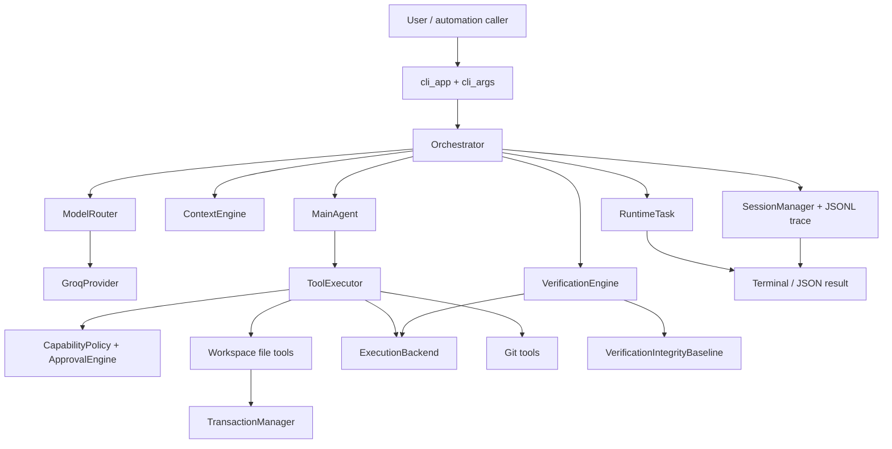
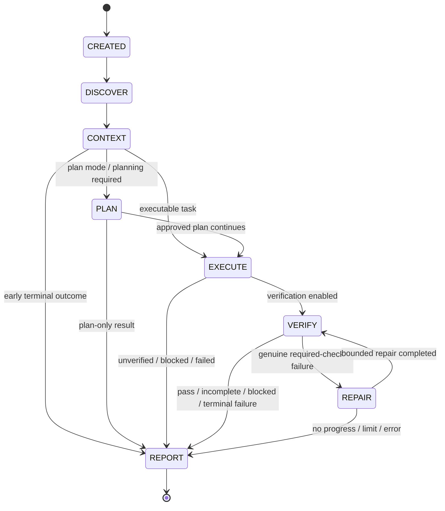
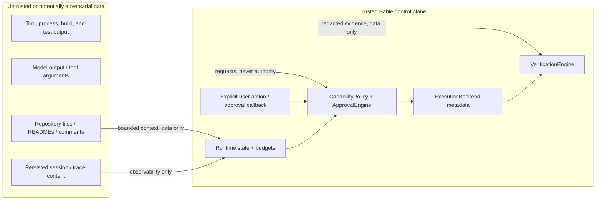
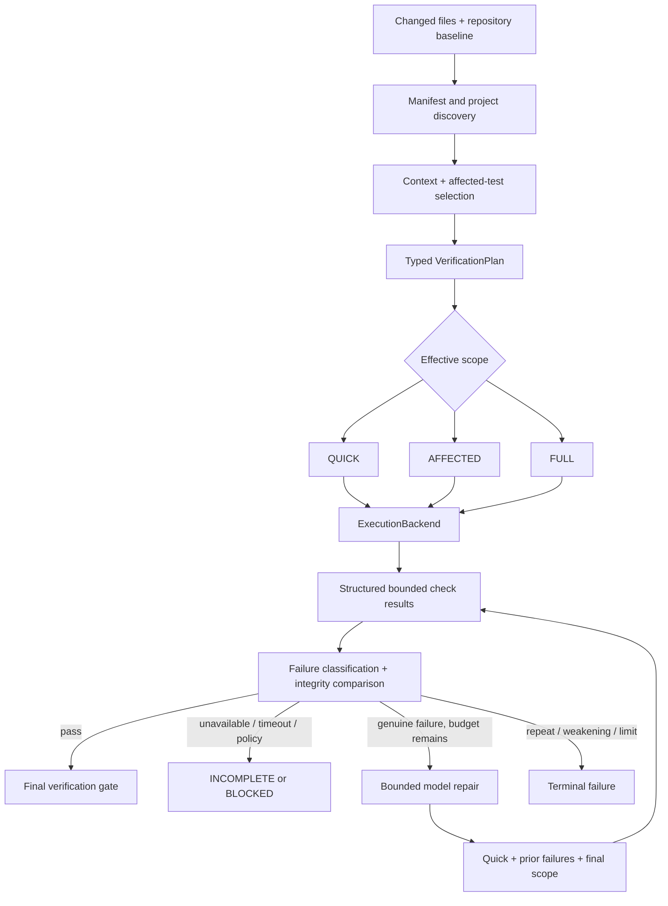
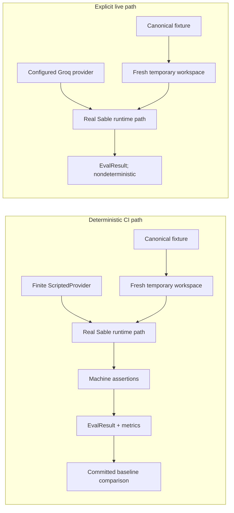

# Sable architecture

Sable is a local control plane around a tool-using model. The model proposes actions;
the runtime owns lifecycle transitions, context selection, tool execution, capability
decisions, transactions, verification, observability, and final status. Groq is the
current production provider, while deterministic evaluations substitute finite
scripted responses and still drive the real product path.

This document explains the relationships between the major modules. It is not an API
reference and does not expand the guarantees in [SECURITY.md](../SECURITY.md).

## Component map



The CLI resolves an existing workspace and chooses interactive, one-shot, or doctor
behavior. `Orchestrator` opens the `RuntimeTask` and transaction, captures repository
state, invokes context and provider routes, coordinates `MainAgent`, and decides
whether verification, repair, Git automation, or rollback is allowed. No provider
response directly mutates runtime state.

`ToolExecutor` validates every model tool request against mode, capability,
workspace, protected paths, and command policy. Workspace file tools and subprocess
backends are deliberately separate: file-tool paths are strongly confined and
transaction-aware, while native child programs retain the OS user's ambient
filesystem reach.

## Task lifecycle

`RuntimeTask` validates this transition graph in `sable/runtime.py`:



Every task starts at `CREATED`, enters discovery, and reaches exactly one terminal
`REPORT` phase. `PLAN` and `REPAIR` are conditional; a task does not necessarily visit
every node. Invalid transitions raise `RuntimeStateError`. Terminal status and
termination reason distinguish verified success, explicit unverified completion,
plan-only completion, policy denial, budget exhaustion, verification failure or
incompleteness, cancellation, provider failure, and unexpected abort.

Bounded structured events cover phase changes, context selection, provider/tool
activity, capability decisions, backend execution, verification, repair,
transactions, rollback, Git, and terminal outcome. Persistence failure is observable
but cannot rewrite the task result.

## Trust and authorization boundaries

The trusted boundary is the runtime control path—not arbitrary text from a human,
repository, provider, or subprocess. Direct user actions arrive with `USER`
provenance, but their paths/commands still pass hard validation.



Only the runtime creates capability request IDs and exact-action scope hashes.
`ALLOW_ONCE` is consumed once. `ALLOW_SESSION` is scoped to the same session,
capability, tool, and action digest and is never rehydrated from traces. Repository
instructions and model-supplied authorization fields cannot create approval, change
provenance, widen scope, or bypass a plan-mode ceiling.

Protected paths, workspace traversal/symlink escape, workspace-root deletion, and
external file-tool access remain hard-denied. Known package, network, remote-Git, and
shell actions are capability-classified, but neither current backend prevents an
arbitrary program from using all resources available to the Sable OS user.

## Execution guarantees

The table below mirrors the authoritative security model. The first row belongs to
Sable's file-tool layer; subprocess workspace visibility is a separate property.

| Guarantee | Native | PRoot |
|---|---|---|
| Sable file tools confined to workspace | `ENFORCED` | `ENFORCED` |
| Project-process cwd validated inside workspace | `ENFORCED` at launch | `ENFORCED` at launch |
| Project-process workspace visibility | `NOT_SUPPORTED` | `BEST_EFFORT` path/root remapping |
| Private HOME for project/build processes | `ENFORCED` | `ENFORCED` |
| Sanitized project-process environment | `ENFORCED` | `ENFORCED` |
| Shell disabled by default | `ENFORCED` | `ENFORCED` |
| Kernel filesystem namespace | `NOT_SUPPORTED` | `NOT_SUPPORTED` |
| Network isolation | `NOT_SUPPORTED` | `NOT_SUPPORTED` |
| Process namespace/isolation | `NOT_SUPPORTED` | `NOT_SUPPORTED` |
| Resource limits | POSIX `BEST_EFFORT`; Windows `NOT_SUPPORTED` | host POSIX `BEST_EFFORT` |
| Descendant cleanup on timeout | POSIX group; Windows `BEST_EFFORT` | PRoot + host group `BEST_EFFORT` |

`ENFORCED` means the named layer applies the control for that operation.
`BEST_EFFORT` describes a useful mechanism that is not a security boundary.
`NOT_SUPPORTED` is an explicit absence of an enforcement claim.

Native execution uses argument arrays and `shell=False` for normal commands, a
validated cwd, private HOME/temp, sanitized environment, bounded output/time, and
host-appropriate cleanup. It does not hide the host filesystem or block sockets.
PRoot maps a caller-supplied rootfs, the workspace at `/workspace`, and private HOME
at `/home/sable`; this is user-space path remapping rather than a kernel namespace.
See [execution security](execution-security.md) for selection and capability details.

## Verification flow



Discovery is local and manifest-first. Changes to manifests, CI/build/test settings,
or verification configuration escalate `AFFECTED` to `FULL`. Checks execute with the
same backend policy, environment sanitation, private HOME, cwd validation, timeouts,
and output bounds as other project commands.

Only a genuine required-check failure can enter `REPAIR`. Missing tools, policy
blocks, and timeouts stay incomplete or blocked. Repair gets bounded redacted
evidence and stops when stable failure signatures repeat. The integrity baseline
blocks high-confidence weakening such as test deletion, blanket skip insertion, or
disabled verification scripts. These are heuristics, not semantic proof.

## Transaction and recovery flow

```mermaid
flowchart TD
    Start[Task transaction opens] --> First[First file-tool mutation of path]
    First --> Snapshot[Capture bounded baseline snapshot]
    Snapshot --> Mutate[Apply validated mutations]
    Mutate --> Fingerprint[Record post-state fingerprint]
    Fingerprint --> Outcome{Task outcome}
    Outcome -->|success or visible failure| Retain[Persist bounded transaction metadata]
    Outcome -->|unexpected orchestrator error| Auto[Attempt conflict-aware rollback]
    Retain --> Undo[/txn or /undo --dry-run]
    Undo --> Compare{Current fingerprint}
    Compare -->|matches post-state| Restore[Restore baseline]
    Compare -->|already baseline| Already[Report already restored]
    Compare -->|different| Conflict[Preserve later edit; report conflict]
    Auto --> Compare
```

Snapshots are created once per path before its first Sable file-tool mutation.
Snapshot limits fail closed before mutation. Rollback walks paths in reverse order
and never uses `git reset`, `clean`, or checkout. It does not rewrite Git history.
Changes performed by tests, builds, raw shell, or arbitrary subprocesses are outside
this transaction guarantee. See [transactions](transactions.md) for limits and
dirty-at-start behavior.

## Context, provider routing, sessions, and traces

`ContextEngine` ranks bounded repository material using path, symbol, import,
test-neighbor, manifest, and query signals. It reports selected and considered files
and may route bounded compression through the fast-model purpose. Fast routes receive
no tools and fall back to deterministic local compression on provider failure.

`ModelRouter` normalizes provider responses and usage. Groq is the only concrete
production provider in this release. Provider output remains a request/input to the
runtime rather than an authorization source.

`SessionManager` stores bounded summaries and JSONL task traces locally. Persisted
data supports continuity and audit, not control: malformed records are ignored,
session grants are not restored, and trace writes cannot change an outcome. Secrets,
authorization IDs, internal scope hashes, auth headers, and child environments are
excluded or redacted. See [context](context-engine.md), [runtime](runtime.md), and
[sessions](sessions.md).

## Evaluation architecture



Deterministic scenarios use committed synthetic fixtures and a finite
`ScriptedProvider`, but drive real orchestrator, agent, tool, policy, transaction,
verification, session, and automation paths. Assertions cover outcomes, changed and
forbidden files, events, capabilities, verification, budgets, rollback, and context.
The committed baseline fixes scenario membership, allowed platform skips, and minimum
rates without encoding volatile timings.

Live evaluation uses the real provider, can consume quota, is nondeterministic, and
must be invoked explicitly. It is not part of ordinary CI and must not be combined
with the deterministic baseline. See [evaluation methodology](../evals/README.md).

## Boundary summary

Sable can enforce its own file-tool, lifecycle, approval, budget, verification, and
publication policies. It can provide recoverability for its own file mutations and
structured evidence for executions. It cannot turn native or PRoot execution into a
kernel sandbox, prove program correctness, detect every network-capable command or
secret representation, or guarantee complete affected-test selection. Those limits
are architecture, not footnotes.
